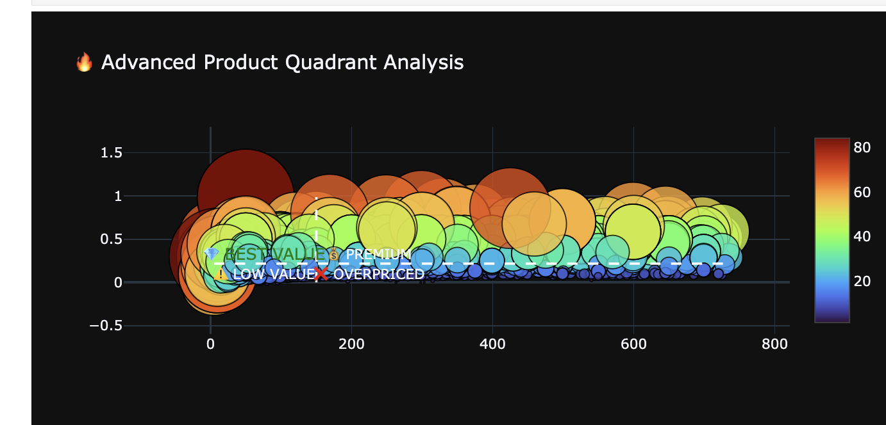

## 🛒 DMart Product Intelligence: Beyond the Discount
Optimizing Retail Value through Advanced Feature Engineering & Behavioral Analytics

## 📖 1. The Narrative: The "Discount Trap" Story
In the hyper-competitive Indian retail landscape, "Discounting" is often the only lever used to capture market share. DMart operates on a high-volume, low-price model, but a critical question remains: Is every discount driving loyalty, or are some merely burning margins?

This project uncovers the "Value Gap." By analyzing over 5,000 SKUs, we discovered that while 99.8% of the inventory is discounted, only a fraction of those products deliver "High Value" to the consumer. This repository documents the journey of transforming a static product catalog into a dynamic intelligence system that identifies "Retention Heroes"—products that don't just offer a lower price, but a price-to-utility ratio that ensures repeat business.

## 🏗️ 2. The Strategic Challenges
To move from raw data to actionable insights, this project addressed three core challenges:

The Normalization Paradox: Developing a way to compare the "deal quality" of a ₹10 staple versus a ₹1,000 premium item.

The Price-Volume Illusion: Using Price per 100g metrics to strip away packaging bias and find true unit economic value.

Proxy Retention Modeling: Since transaction timestamps were unavailable, we engineered a Synthetic Retention Index based on price-competitiveness and category rankings.

## 💻 3. Technical Implementation (Python)
The backbone of this project is built on specialized feature engineering. We moved beyond basic arithmetic to create multi-factor indices.

A. Core Feature Engineering
We calculated "Savings Efficiency" and "Unit Value" to quantify the customer’s psychological perception of a deal.

## Python
## Which products deliver the highest customer value when considering both price and savings, and which products are potentially overpriced due to low value contribution?

Product value is not driven by price alone, but by how effectively pricing translates into meaningful customer savings. Products that combine affordability with strong discounts consistently deliver higher value, while high-priced products without proportional savings tend to underperform. This highlights the need for optimized pricing and discount strategies that focus on value creation rather than price positioning alone.

##  What factors drive product value when analyzing the combined impact of price, discount percentage, and overall deal attractiveness in a multi-dimensional (3D) analytical space?

Product value is not determined by price alone, but by the dynamic interaction between price and discount. The highest-value products emerge within an optimal range where moderate pricing is complemented by strong discounting. This indicates that value is maximized when affordability aligns with meaningful savings, emphasizing the importance of balanced and strategic pricing models.

## Which factors have the strongest influence on product value, and how do pricing and discount dynamics interact to shape customer value perception?

“The analysis reveals that product value is predominantly driven by discount percentage, with deal score acting as a supporting factor, while price itself plays a minimal direct role. Higher unit costs further reduce perceived value, reinforcing that customers prioritize savings efficiency over absolute price levels. This highlights that effective value creation depends on optimizing discount strategies and cost efficiency rather than simply adjusting prices.”

##  Which categories and brands contribute most significantly to overall product value, and how is this value distributed across the product hierarchy?

“The analysis highlights that overall product value is highly concentrated within essential categories such as Grocery, Dairy & Beverages, and Home & Kitchen, where a small group of dominant brands contributes the majority of value. This skewed distribution demonstrates that value creation is not evenly spread across the product hierarchy, but is driven by high-impact categories and brands that optimize both pricing and discount strategies. It underscores the importance of focusing on key segments to maximize overall business value.”
## How do key factors such as price, discount percentage, value score, and deal score interact to influence overall product value?

Product value is determined by the combined interaction of multiple factors, with discount percentage emerging as the primary driver. Deal score further strengthens value perception, while price plays a secondary, supporting role. Products achieve the highest value when moderate pricing is complemented by strong discounts and attractive deal scores. In contrast, low discount levels result in poor value perception regardless of price, highlighting the critical role of effective discount strategies.

## 📊 4. Data-Driven Insights
Our analysis yielded high-impact findings that challenge traditional retail assumptions:

I. The Value Funnel Leakage
Observation: Out of 4,732 products, 4,722 are discounted. However, only 1,180 qualify as "High Value."

Insight: There is a 75% drop-off between a discount being offered and a discount being meaningful. Most discounts are "noise" that fail to move the needle on customer value perception.

II. Category "Retention Heroes" vs. "Margin Burners"
High Performance: Personal Care and Home & Kitchen show the highest retention potential.

The Staple Trap: Groceries have high volume but surprisingly low retention scores per SKU, indicating high price-sensitivity and low brand loyalty in that segment.

III. The Power of Organic Staples
Data shows that 24 Mantra Organic products (Atta, Brown Rice, Sugar) consistently score the highest on the Deal Index (>400), serving as the "Anchor Products" for the entire DMart ecosystem.

## 📈 5. Visual Dashboard Summary- Excel
The project culminated in a KPI dashboard reflecting the following health metrics:

Total Consumer Savings: ₹556,940.01

Average Global Discount: 26.39%

Average Deal Score: 42.96

The Golden Ratio: We found that every 1% of discount only yields a 0.4% increase in the Retention Index, suggesting a plateau effect where deeper discounts stop providing value.

## 🎯 6. Conclusion: Strategic Roadmap
Based on the data, the following actions are recommended:

Optimize the Funnel: Re-evaluate the pricing of the 3,500+ products in the "Value Gap" (Discounted but not High Value).

Highlight Retention Heroes: Pivot marketing spend toward the top 15% of products that drive the highest Deal Scores.

Dynamic Pricing: Implement the Python-based deal_score algorithm into the live storefront to automatically badge products that offer superior unit-economic value.

Final Verdict: Retail intelligence is not about being the cheapest; it is about being the most valuable. This project provides the mathematical framework to ensure every rupee of discount translates into customer loyalty.
