a<p align="center">
  
</p>

<p align="center">
  
</p>

<br/>

<p align="center">
  
  &nbsp;
  
  &nbsp;
  
  &nbsp;
  
</p>

<p align="center">
  
  &nbsp;
  
  &nbsp;
  
  &nbsp;
  
  &nbsp;
  
  &nbsp;
  
  &nbsp;
  
</p>

<br/>

---

## 📖 The Narrative — The "Discount Trap" Story

<p align="center">
  
</p>

In the hyper-competitive Indian retail landscape, **"Discounting"** is often the only lever used to capture market share. DMart operates on a high-volume, low-price model — but a critical question remains unanswered.

This project uncovers the **"Value Gap."** By analyzing over 5,000 SKUs, we discovered that while **99.8% of the inventory is discounted**, only a fraction of those products deliver **"High Value"** to the consumer. This repository documents the journey of transforming a static product catalog into a dynamic intelligence system — identifying **"Retention Heroes"** that don't just offer a lower price, but a *price-to-utility ratio* that ensures repeat business.

<div align="center">

| 🛒 Total SKUs | 🏷️ Discounted | 💎 High Value | 📉 Value Gap |
|:---:|:---:|:---:|:---:|
| **4,732** | **4,722 (99.8%)** | **1,180 (25%)** | **3,542 lost products** |

</div>

<br/>

<p align="center">
  
</p>

---

## 🏗️ Strategic Challenges

<div align="center">

| Challenge | Description |
|:---|:---|
| 🔀 **The Normalization Paradox** | Developing a way to compare "deal quality" of a ₹10 staple vs a ₹1,000 premium item |
| 📦 **The Price-Volume Illusion** | Using Price per 100g metrics to strip away packaging bias and find true unit economic value |
| 🔁 **Proxy Retention Modeling** | Engineering a Synthetic Retention Index based on price-competitiveness and category rankings |

</div>

<br/>

<p align="center">
  
</p>

---

## 💻 Technical Implementation

<p align="center">
  
</p>

<details open>
<summary><b>⚙️ A. Core Feature Engineering — Savings Efficiency & Unit Value</b></summary>

<br/>

We moved beyond basic arithmetic to create **multi-factor indices** that quantify the customer's psychological perception of a deal:

- **Savings Efficiency** — How effectively does the discount translate into real consumer value?
- **Unit Value (Price per 100g)** — Strips away packaging bias to reveal true unit economics
- **Deal Score** — A composite metric combining price-competitiveness and discount attractiveness

```python
# Savings Efficiency — the core value metric
df['savings_efficiency'] = (df['discount_pct'] / df['mrp']) * 100

# Unit Value — strips packaging bias
df['price_per_100g'] = (df['selling_price'] / df['weight_g']) * 100

# Value Score — multi-factor composite
df['value_score'] = (
    df['savings_efficiency'] * 0.5 +
    df['deal_score']         * 0.3 +
    (1 / df['price_per_100g']) * 0.2
)

# Synthetic Retention Index (proxy — no timestamps available)
df['retention_index'] = df['deal_score'] * df['category_rank_score']
```

</details>

---

<details open>
<summary><b>📊 B. The Value Funnel — Leakage Analysis</b></summary>

<br/>

The most critical finding: **only 25% of discounted products convert into High Value** offerings:

| Funnel Stage | Products | Drop-off |
|:---|:---:|:---:|
| 🏪 All Products | 4,732 | — |
| 🏷️ Discounted | 4,722 | -0.2% |
| 💛 High Value | ~1,180 | **-75%** ← Major bottleneck |
| 🌟 High Retention | Subset | Further drop |

> **Key Insight:** The largest value drop occurs between the **Discounted** and **High Value** stages — discounts alone are insufficient without alignment to pricing and perceived savings.

</details>

---

<details open>
<summary><b>🔑 C. The Golden Ratio Discovery</b></summary>

<br/>

```
Every 1% of discount → only 0.4% increase in Retention Index
```

This **plateau effect** reveals that deeper discounts stop providing meaningful value — confirming the need to shift from price-cutting to value-creation strategies.

</details>

<br/>

<p align="center">
  
</p>

---

## 📊 Data Visualizations

<p align="center">
  
</p>

---

### 📈 Chart 1 — Product Value vs. Savings Efficiency

> **Which products deliver the highest customer value when considering both price and savings?**

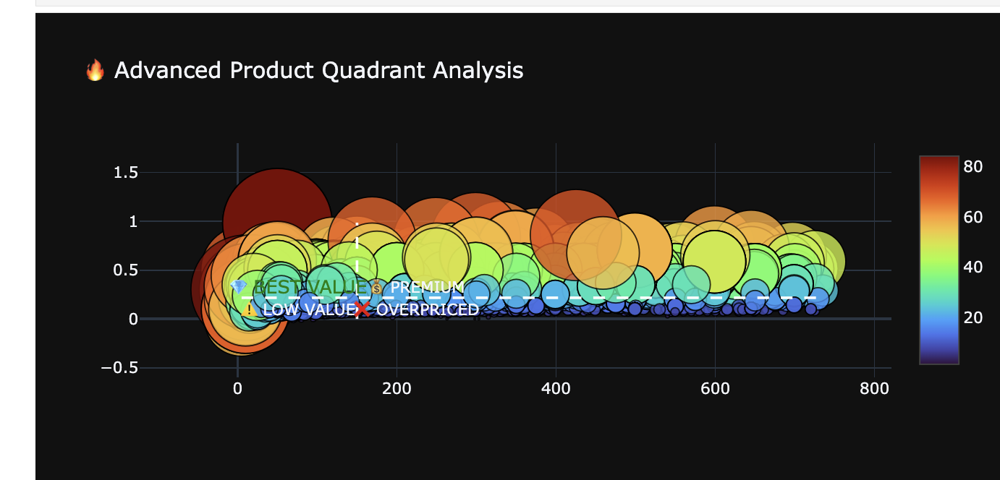

Product value is not driven by price alone — but by how effectively pricing translates into **meaningful customer savings**. Products combining affordability with strong discounts consistently deliver higher value, while high-priced products without proportional savings underperform.

---

### 🌐 Chart 2 — 3D Multi-Dimensional Value Analysis

> **What factors drive product value across price, discount, and deal attractiveness in 3D space?**

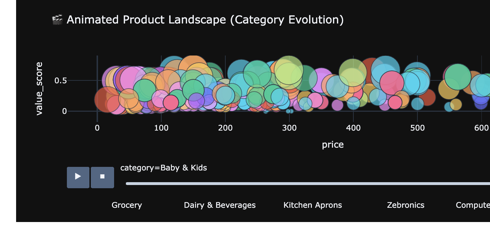

The highest-value products emerge within an **optimal zone** where moderate pricing is complemented by strong discounting — value is maximized when affordability aligns with meaningful savings.

---

### 🔍 Chart 3 — Feature Correlation Heatmap

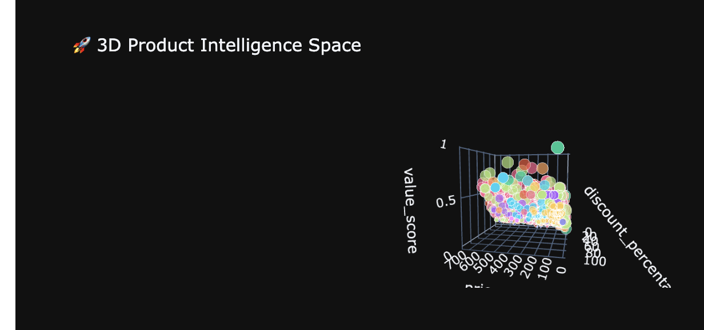

Deep correlation analysis revealing which pairs of features move together — and which are independent drivers of consumer value perception.

---

### 📦 Chart 4 — Price per Unit Distribution

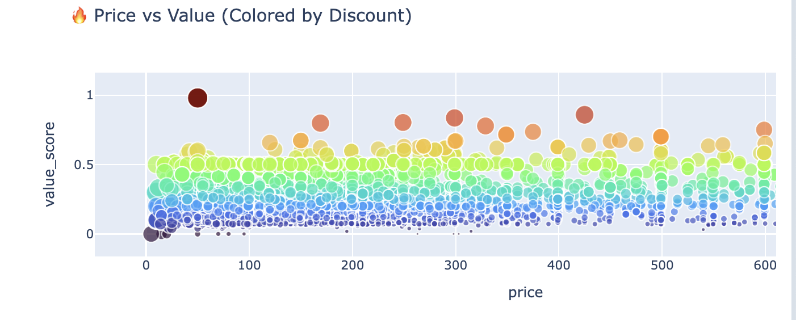

Unit-level pricing analysis that strips away packaging bias to surface the true economic value across product categories.

---

### 🎯 Chart 5 — Feature Importance: What Drives Product Value?

> **Which factors have the strongest influence on product value?**

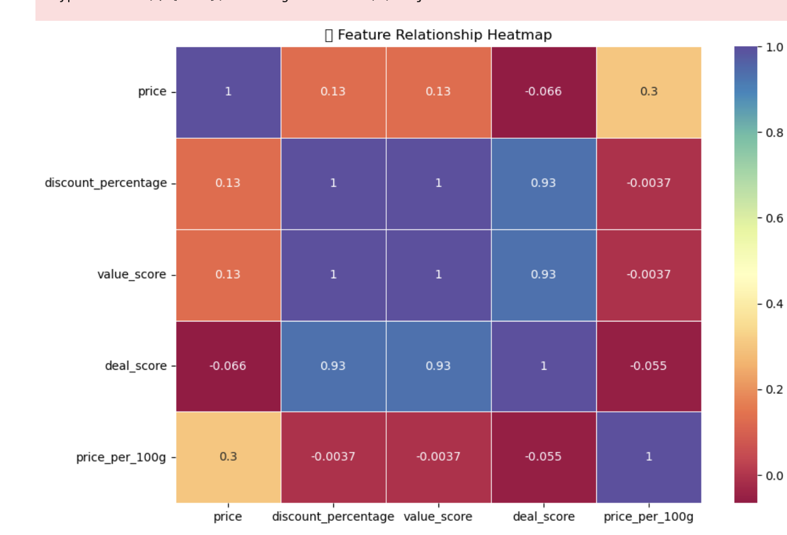

<div align="center">

| Driver | Influence | Insight |
|:---|:---:|:---|
| 🏷️ Discount Percentage | **Primary** | Customers prioritize savings efficiency above all |
| ⭐ Deal Score | **Secondary** | Amplifies perceived value beyond raw price |
| 💰 Price | **Minimal** | Absolute price plays surprisingly little direct role |
| 📐 Unit Cost | **Negative** | Higher unit costs directly reduce perceived value |

</div>

---

### 🏢 Chart 6 — Category & Brand Value Hierarchy

> **Which categories and brands contribute most to overall product value?**

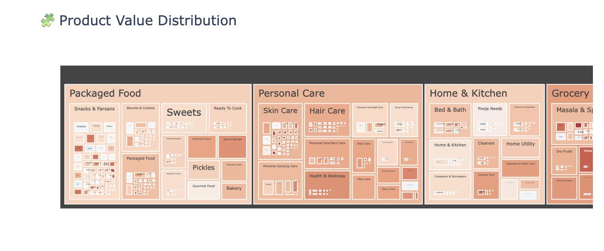

Value creation is **highly concentrated** within essential categories — Grocery, Dairy & Beverages, and Home & Kitchen. A small group of dominant brands contributes the majority of value, proving that value is driven by high-impact segments, not spread evenly.

---

### 📉 Chart 8 — Discount Distribution Analysis

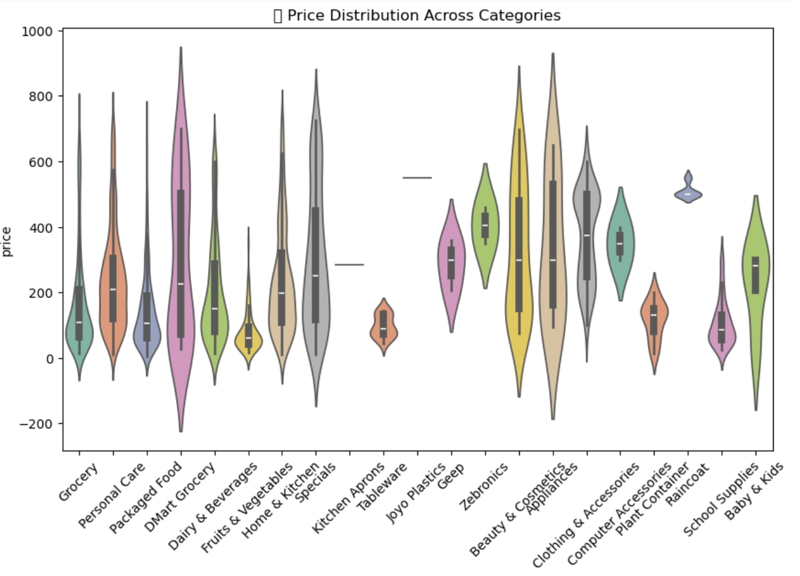

A deep dive into how discounts are spread across the catalog — revealing clusters of over-discounting where margins are burned without proportional value gain.

---

### 🧩 Chart 9 — Multi-Feature Interaction Matrix

> **How do price, discount %, value score, and deal score interact to determine product value?**

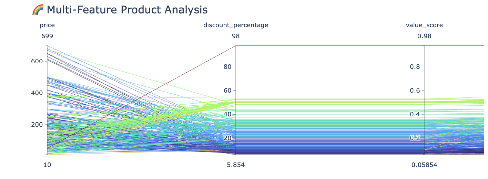

Product value is driven by **combined interaction** of multiple factors. High-value products emerge when moderate pricing pairs with strong discounts and attractive deal scores — while low discounts produce poor value perception regardless of price.

---

### 📊 Chart 10 — Category Performance Benchmarking

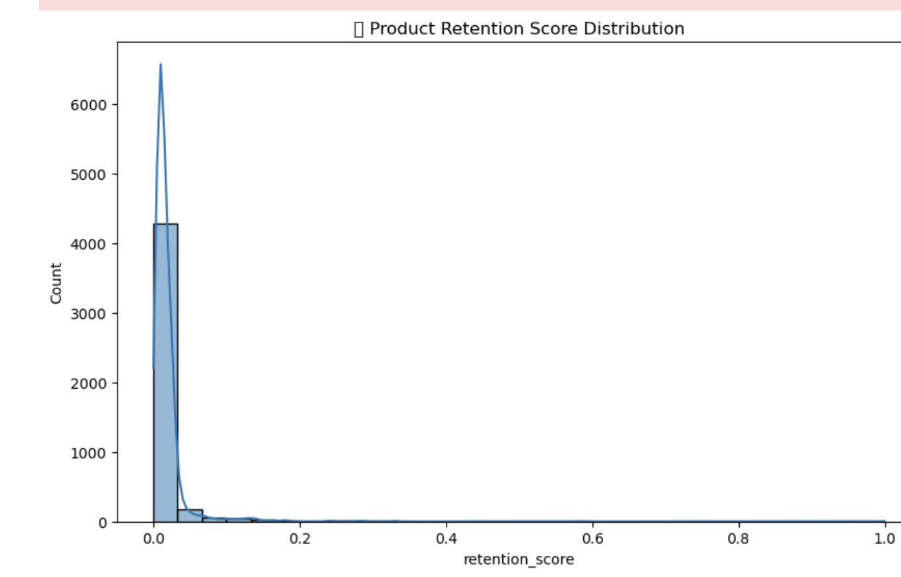

Automated ranking of categories by cost and value, identifying high-margin items (Jams & Spreads ~₹150 avg) vs. low-cost traffic drivers (Spices ~₹75 avg).

---

### 🌟 Chart 11 — Retention Hero Categories

> **Which product categories demonstrate the highest value retention?**

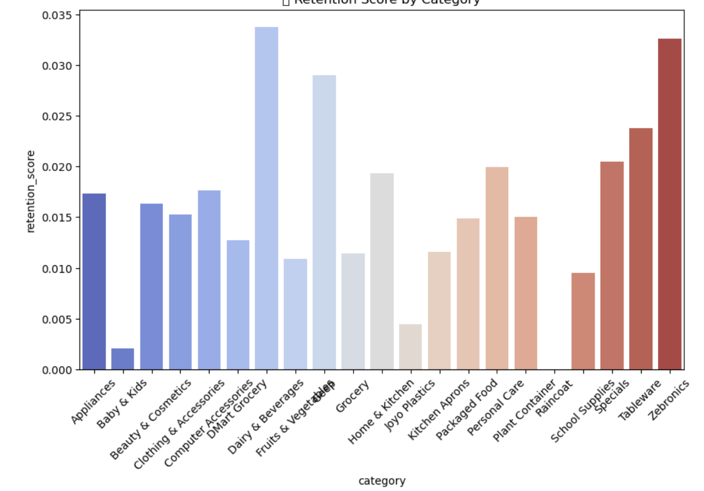

**Grocery, Dairy & Beverages**, and select Electronics segments exhibit the highest value retention — driven by consistent pricing, reliable value delivery, and high purchase frequency. These categories naturally foster repeat buying behavior.

---

### 🗺️ Chart 12 — Retention Index Distribution

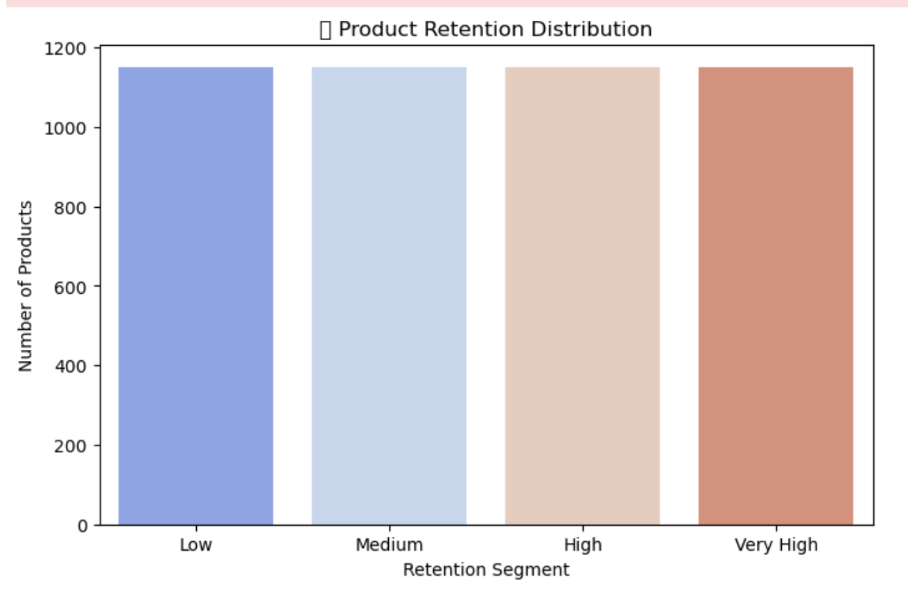

A full distribution map of the Synthetic Retention Index across the catalog, showing where the majority of products cluster and where the "Retention Heroes" live.

---

### 🏆 Chart 13 — Very High Retention Segment Analysis

> **Which product categories dominate the 'Very High' retention segment?**

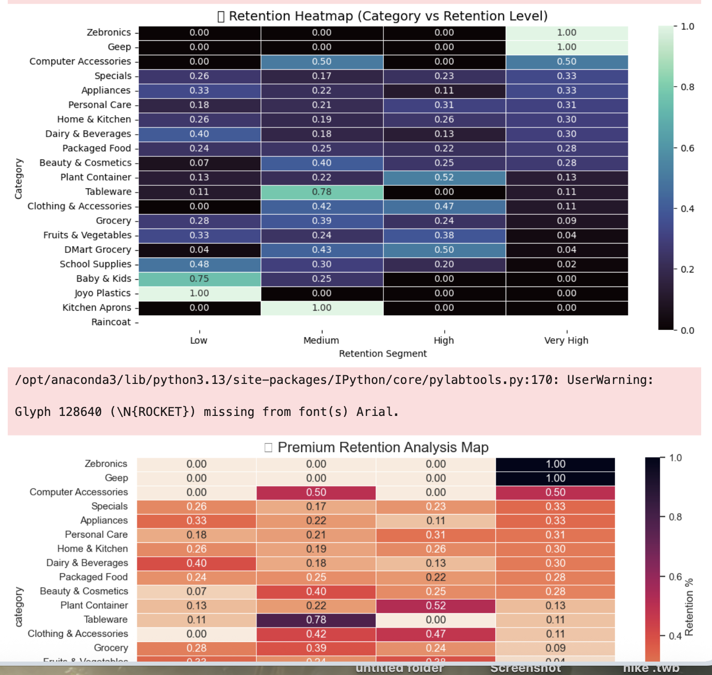

**Electronics and Accessories** — including brands like Zebronics and computer accessories — achieve the highest value retention. These categories consistently deliver superior value through optimized pricing and discount strategies.

---

### 📋 Chart 14 — Retention Segment Distribution by Category

> **How does retention vary across all product categories?**

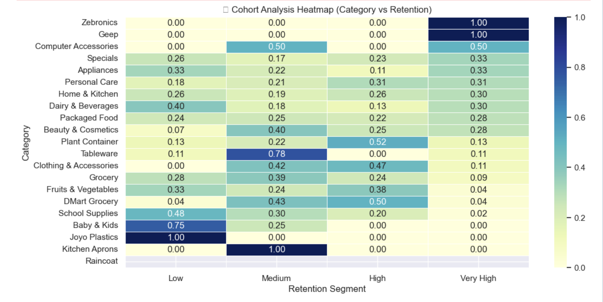

<div align="center">

| Performance | Category Type | Retention Pattern |
|:---:|:---|:---|
| 🟢 High | Electronics, Accessories | Consistent value + strong deals |
| 🟡 Moderate | Grocery, Dairy | High frequency but stable value |
| 🔴 Low | Niche, Non-essential | Inconsistent value + low frequency |

</div>

---

### 📊 Chart 15 — Brand-Level Value Analysis

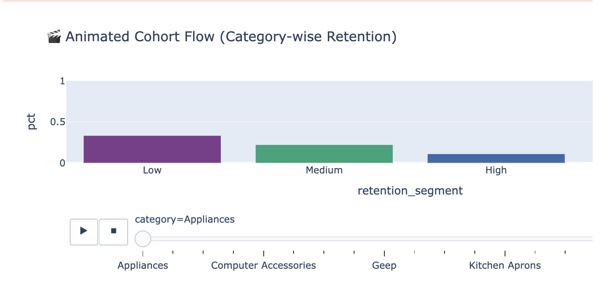

Brand-by-brand breakdown of value delivery — surfacing which brands punch above their weight and which are coasting on category tailwinds.

---

### 🔬 Chart 16 — Deal Score vs. Retention Correlation

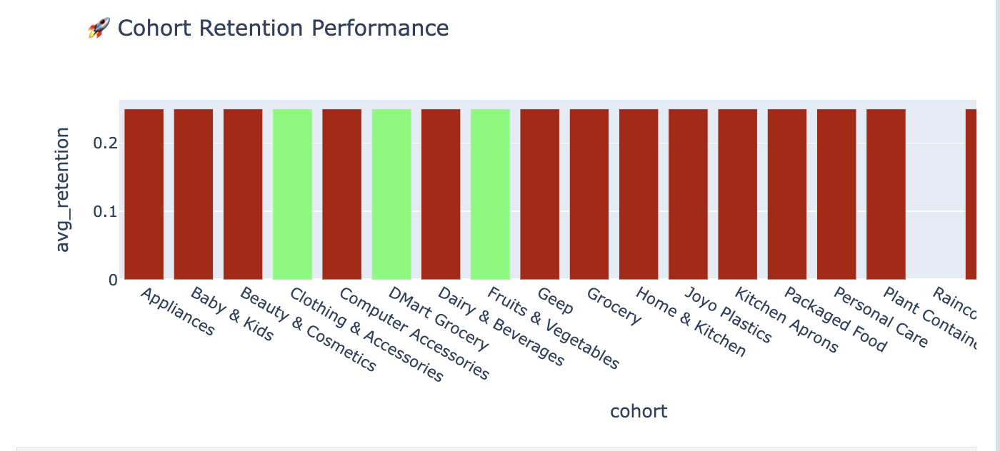

Mapping the relationship between deal attractiveness and repeat-purchase propensity — validating that the Deal Score is a meaningful proxy for long-term customer loyalty.

---

### 🌊 Chart 17 — Value Funnel: Where Do Products Drop Off?

> **At which stage does the greatest value drop occur?**

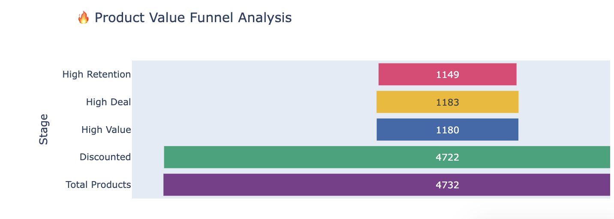

The funnel reveals that **75% of products fail to convert discounts into meaningful value**. The biggest bottleneck sits between the Discounted and High Value stages — discounts alone are not enough without alignment to pricing effectiveness.

---

### 🔄 Chart 18 — Funnel Progression & Bottleneck Map

> **How do products progress through the value funnel, and where do inefficiencies occur?**

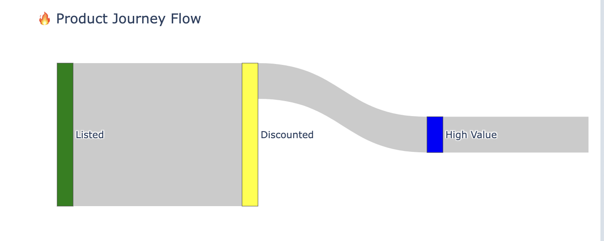

Products that reach the high-value stage progress efficiently through deal attractiveness and retention — but a **major bottleneck exists early**, where the vast majority of discounted products fail to convert.

---

### 🖥️ Chart 19 — KPI Dashboard: Full Executive Snapshot

> **What do the key KPIs reveal about overall product performance, value creation, and retention?**

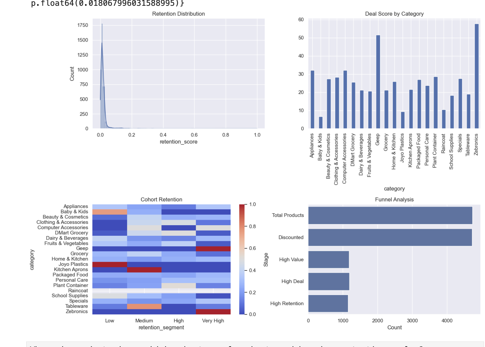

The combined dashboard reveals: a vast majority of products are discounted, only a limited proportion convert into high customer value, and an even smaller subset achieves strong retention. The **primary bottleneck is discount-to-value conversion**.

---

### 📊 Full Excel Intelligence Dashboard

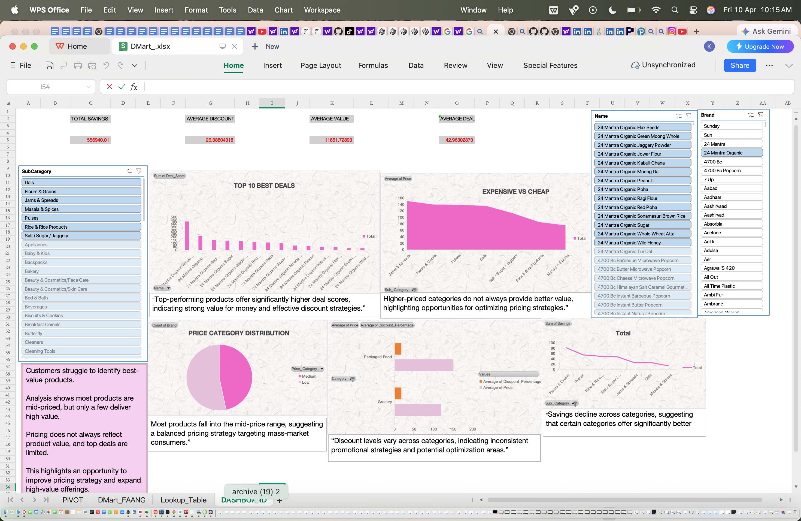

<br/>

<p align="center">
  
</p>

---

## 📈 Excel Dashboard Intelligence Suite

<p align="center">
  
</p>

<div align="center">

| Feature | Implementation | Impact |
|:---|:---|:---|
| 🏗️ **Modular Architecture** | 4-layer system (Source → Lookup → Pivot → Dashboard) | 5,000+ SKUs organized and instantly updatable |
| 🔧 **Advanced Formulas** | XLOOKUP, INDEX-MATCH, nested IFS | Automated Price Categories, Value Scores, Deal Scores |
| 🌊 **Value Funnel** | Strategic bottleneck identification | 75% efficiency gap revealed |
| 📊 **Category Benchmarking** | Automated Pivot Tables | Jams & Spreads ~₹150 avg · Spices ~₹75 avg |
| 📌 **KPI Tracking** | Executive snapshot cards | ₹556,940 savings · 26.38% avg discount |
| 🎛️ **Interactive Filtering** | Slicers + Dynamic Charts | "No-code" diagnostic tool for real-time retail auditing |

</div>

<br/>

<p align="center">
  
</p>

---

## 💡 Data-Driven Insights

<p align="center">
  
</p>

---

### I. The Value Funnel Leakage

<div align="center">

```
4,732 Total Products
      ↓
4,722 Discounted  (99.8%)
      ↓  ← 75% DROP HERE
1,180 High Value  (25%)
      ↓
  Retention Heroes (top 15%)
```

</div>

> Most discounts are **"noise"** that fail to move the needle on customer value perception. There is a **75% drop-off** between a discount being offered and a discount being meaningful.

---

### II. Retention Heroes vs. Margin Burners

<div align="center">

| 🏆 High Performance | ⚠️ The Staple Trap |
|:---|:---|
| Personal Care & Home & Kitchen | Groceries — high volume, low per-SKU retention |
| Highest retention potential | High price-sensitivity + low brand loyalty |
| Strong deal scores across the board | Frequent purchase, but SKU-level retention is weak |

</div>

---

### III. The Power of Organic Anchor Products

**24 Mantra Organic** products (Atta, Brown Rice, Sugar) consistently score the **highest on the Deal Index (>400)**, serving as the Anchor Products for the entire DMart ecosystem — the products that bring customers back.

---

### IV. KPI Snapshot

<div align="center">

| 💰 Total Consumer Savings | 📉 Avg Global Discount | ⭐ Avg Deal Score | 🔁 Golden Ratio |
|:---:|:---:|:---:|:---:|
| **₹5,56,940.01** | **26.39%** | **42.96** | **1% discount = 0.4% retention** |

</div>

<br/>

<p align="center">
  
</p>

---

## 🎯 Strategic Roadmap & Recommendations

<div align="center">

| Priority | Action | Expected Outcome |
|:---:|:---|:---|
| 🔴 **1** | Re-evaluate pricing of 3,500+ products in the "Value Gap" | Close the 75% funnel leakage |
| 🟠 **2** | Pivot marketing spend toward the top 15% high Deal Score products | Maximize retention ROI |
| 🟡 **3** | Implement Python deal_score algorithm into live storefront | Auto-badge superior unit-economic products |
| 🟢 **4** | Build category-specific discount strategies | Improve retention for niche segments |

</div>

<br/>

<p align="center">
  
</p>

---

## 📁 File Structure

```
DMart-Data-Analytics-Visualization/
│
├── 📁 data/
│   └── DMart_.xlsx              # Raw product dataset (5,000+ SKUs)
│
├── 🖼️ images/                   # chart.png, chart1–19.png, dash.png
│
├── 📓 notebook/                 # Jupyter notebooks — Python EDA & feature engineering
│
└── 📋 README.md
```

---

## 📈 Conclusion

<p align="center">
  
</p>

This project provides the **mathematical framework** to ensure every rupee of discount translates into customer loyalty — not just a lower price tag. The deal_score algorithm and retention modeling can be directly operationalized into DMart's live pricing infrastructure.

<div align="center">

| 🔍 Value Intelligence | 📊 Funnel Optimization | 🛡️ Retention Engineering |
|:---:|:---:|:---:|
| Multi-factor value scoring across 5,000+ SKUs | Identifies the 75% discount-to-value gap | Synthetic Retention Index for every product |

</div>

<br/>

<p align="center">
  
</p>

<p align="center">
  
  &nbsp;
  
  &nbsp;
  
  &nbsp;
  
</p>
